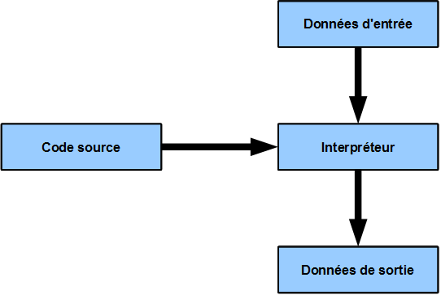

# L’asynchronisme en Python




## La problématique 

Python c'est cool. Ce langage possède une forte abstraction, il va donc à l'essentiel et il est simple à apprendre. Bon, j'arrête la propagande.

Mais il s'avère que c'est un langage interprété, il faut donc un programme pour faire fonctionner votre propre-programme, j'ai nommé : l’interpréteur. 



 C'est bien l'interpréteur qui est coupable des pertes en performance en Python : 

* Le code source est "lu" à la volée, cela demande plus de temps de calcul 
* Il utilise le concept du Global Interpeter Lock \(GIL\) qui est un moyen pour Python de protéger les accès à la mémoire. Utiliser des threads est donc souvent contre-productif.

Pour en savoir plus sur les threads : [https://fr.wikipedia.org/wiki/Thread\_\(informatique\)](https://fr.wikipedia.org/wiki/Thread_%28informatique%29)

En gros : C'est un moyen pour le programme de faire plusieurs choses en même temps, on parle de parallélisme dans ce cas précis. 

## La solution 

Elle porte le doux nom d'asynchronisme et derrière ce nom qui rend le concept plutôt badass se cache une situation qu'on rencontre tous les jours pour les amateurs de fast-food.


### Dans un fast-food : l'équipier \(intelligent\) qui ne fait pas attendre les clients  

Mise en contexte : Vous êtes équipier dans un fast-food pour financer je ne sais trop quoi, ou juste pour le fun si vous êtes masochiste. A midi c'est ce qu'on appelle dans le jargon le rush. Vous devez livré très rapidement les menus choisis par les clients affamés qui arrivent par centaine sous peine de vous faire virer parce que votre patron.e frustré.e à la limite du surpoids adore revendiquer son statut. 

Le premier client arrive : il commande une grande frite et une boisson.

Pas de soucis, _vous faites chauffer la friteuse_, **puis pendant que la friteuse chauffe**, _vous allez cherché un gobelet puis vous faite couler la boisson._

Le deuxième client arrive _:_ il commande un hamburger, une boisson est une grande frite.

_Vous faites chauffer la friteuse_, **puis pendant que la friteuse chauffe**, _vous allez cherché un gobelet puis vous faite couler la boisson,_ **puis pendant que la boisson rempli le gobelet**, _vous préparez l'hamburger_.

Évidement il y a encore le plateau à préparer, prendre la commande et j'en passe mais le topos est le même : **Pendant qu'une tâche est en cours, on passe à une autre tâche et on revient quand la tâche en cours est terminé. C'est ce qui s'appelle être asynchrone.**

Imaginez si vous deviez attendre que les frites finissent de frire pour préparer la boisson, ça prendrait un temps fou. 


### Dans votre programme : la procédure qui ne fait pas attendre l'utilisateur

Cette façon de travailler, on peut la retrouver en informatique. C'est d'ailleurs ce qu'utilise tout les sites web à fort trafic comme Facebook ou Netflix. 

Et le schéma est relativement similaire comparé à celui d'un fast-food : Pendant qu'un client tente de se connecter sur mon site, je prend en charge un autre client.

Si votre site est visité par votre grand-mère et votre mère une fois tous les deux mois ça serait inutile voir dégradant pour les performance. 

Par contre si votre site est visité par des milliers d'utilisateurs chaque secondes comme pour le cas de Netflix, cela s'avère obligatoire.

## Les limites de l’asynchronisme

Il est très important de savoir que l’asynchronisme n'interagie par avec le processeur est donc ne vous fera pas gagner en performance \(CPU bound\) mais en rapidité en exploitant les interruptions d'entrée-sortie \(I/O\). 

### Les interruptions d'entrée-sortie

C'est toutes les interruptions liée à la lecture et l'écriture dans un système et qui donc dans le cade de asynchronisme n'ont rien à voir avec le processeur.

Lire un fichier ou écrire dans un fichier peut interrompre un petit temps le programme, c'est liée au disque dur ou au disque SSD.

Faire une requête HTTP peut interrompre le programme le temps de réaliser la requête. C'est liée à la qualité de votre réseau local.

Lire ou écrire dans un base de données et tout le reste.

### Le CPU bound

C'est tout ce qui concerne les tâches qui demandent de la puissance de calcul 

Traiter une image, trier une liste, comparer des fichiers, bref, les trucs de matheux.

Dans ces domaines, l’asynchronisme ne sert à rien : Pour gagner en performance il faut utiliser les différents cœurs du processeur ou crée des threads et des processus.

## Let's code 

Place à la pratique. Afin de vulgariser au mieux le code d'exemple je vais reprendre l'exemple du fast-food : 

```python
import asyncio  # Le module qui nous permet de faire de l'async

"""
Comme nous l'avions dis, 
une fonction asynchrone est une fonction 
qui quand elle va bloqué, va laissé la main à une autre fonction 
elle-même asynchrone.

Pour indiquer qu'une fonction est asynchrone, 
on utilise le mot clé async

Pour indiquer qu'une fonction risque de bloquer, 
on utilise le mot-clé await
"""


async def preparer_boisson():
    """ La fonction qui nous permet de préparer la boisson """
    print("Je prend un gobelet")
    print("La machine à soda fait couler le soda")

    # Représente le temps où le soda sera versé dans le gobelet, on va pouvoir à ce moment là faire autre chose graçe au mot-clé await
    await asyncio.sleep(3) 

    print("Le soda est prêt !")


async def preparer_hamburger():
    """ La fonction qui nous permet de préparer l'hamburger """
    print("Je prépare les ingrédients pour l'hamburger")
    print("Je  fais cuir le steak")

    # Représente le temps de cuisson du steak, on va pouvoir à ce moment là faire autre chose graçe au mot-clé await
    await asyncio.sleep(5) 

    print("Le steak est cuit !")
    print("L'hamburger est prêt !")


async def preparer_frite():
    """ La fonction qui nous permet de préparer les frites """
    print("Je prend le sac de frites")
    print("Je fais chauffer la friteuse")

    # Représente le temps de chauffe des frites, on va pouvoir à ce moment là faire autre chose graçe au mot-clé await
    await asyncio.sleep(5) 

    print("Je verse les frites")
    print("Les frites sont prêtes !")


loop = asyncio.get_event_loop()

# On indique les différentes tâches
commande = asyncio.gather(preparer_boisson(), preparer_frite(), preparer_hamburger())

# On appel la fonction principal
loop.run_until_complete(commande)

"""
Résultat :

Je prend un gobelet
La machine à soda fait couler le soda
Je prend le sac de frites
Je fais chauffer la friteuse
Je prépare les ingrédients pour l'hamburger
Je  fais cuir le steak
Le soda est prêt !
Je verse les frites
Le steak est cuit !
L'hamburger est prêt !
Les frites sont prêtes !
"""
```

