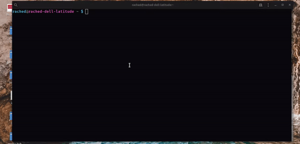

# Commandes de base du terminal sous Debian



_**Qu'est ce que Debian ?**_ : [https://www.debian.org/index.fr.html](https://www.debian.org/index.fr.html)

_**Qu'est ce qu'un terminal ? :**_ [https://fr.wikipedia.org/wiki/Terminal\_\(informatique\)](https://fr.wikipedia.org/wiki/Terminal_%28informatique%29)

## Liste des commandes de base 

### Se déplacer ou supprimer un dossier/fichier

| ls | cd  | rm | rm -r |
| :--- | :--- | :--- | :--- |
| Lister le contenu d'un dossier. | Aller vers un dossier donné. | Supprimer définitivement un fichier. | Supprimer définitvement un dossier. |

### Déplacer ou copier un dossier/fichier

| mv | cp |
| :--- | :--- |
| Déplacer un/des dossier\(s\) ou un fichier d'un chemin A vers un chemin B. | Copier un/des dossier\(s\) ou un fichier d'un chemin A vers un chemin B. |

### Créer un dossier/fichier

| touch | mkdir |
| :--- | :--- |
| Créer un/des fichier\(s\). | Créer un/des dossier\(s\). |

### Visualiser le contenu d'un fichier

| cat | more |
| :--- | :--- |
| Visualiser le texte d'un fichier. | Visualiser le texte d'un fichier tout en utilisant les flèches bas et haut afin de lire petit à petit les lignes de texte. |

### Éditer

| nano lenomdufichier | nvim |
| :--- | :--- |
| Ouvre un éditeur de texte pour terminal. | Ouvre un éditeur de texte pour terminal. |

**NOTE:** L'éditeur nano est installé par défaut sur Debian, néanmoins l'apprentissage de l'éditeur nvim \(variante de vim\) est recommandé. On peut l'installer via cette commande : 

```bash
sudo apt update && sudo apt install neovim
```

### S'informer sur les interfaces réseau

| ifconfig |
| :--- |
| Affiche tout un tas d'informations sur chaque interfaces réseau de la machines. On peut par exemple récupérer l'IP de la machine que l'on manipule. |

### Récupérer du contenu depuis un serveur HTTP

| wget http://lesite.com/mapage.html |
| :--- |
| Récupère un fichier HTML ou autre d'une URL HTTP donné. |

##  Exemple




