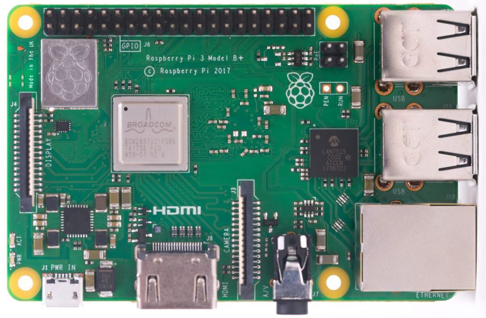

# Le package RPi.GPIO




Facile et indispensable pour un projet embarqué pour le Rasoberry PI, le package RPi.GPIO et une API qui va vous permettre de gérer les GPIO sur votre Raspberry PI.



## À quoi servent les GPIO ?

À envoyer ou réceptionner un courant électrique, c'est tout. C'est l'équivalent des PIN qu'on retrouve sur la célèbre Arduino. On peut y brancher des LEDS \(avec des résistances bien-sûr ...\), un capteur, un autre Raspberry et même un chat. 

Le numéro de chaque GPIO peuvent-être retrouvés dans la partie Raspberry PI du gitbook.

## Installer le RPi.GPIO

Sur le Raspberry PI, on indique au terminal la commande :

```bash
pip3 install --user RPi.GPIO 
```

Et c'est tout.

## RPi.GPIO par l'exemple 

Comme dit précédemment, se servir des GPIO avec cette API n'est pas du tout compliqué. Voici un exemple relativement complet : 

```python
# On souhaite allumer une LED branché au GPIO numéro 8
# On renomme le package dans le code parce que faut pas déconner, c'est long à écrire.
import RPi.GPIO as GPIO  

LED = 8      
# On indique qu'on va suivre la convention BCM 
# (convention qui définit les numéros des GPIO)
GPIO.setmode(GPIO.BCM) 
# On initialise le GPIO numéro 8
GPIO.setup(LED) 

# On éteint et allume la led 5 fois de suite.
for loop in range(5): 
    # On allume la LED (plus précisément, on délivre 5 volt au GPIO 8) 
    GPIO.output(LED, GPIO.HIGH) 
    # On fait une pause de 3 secondes
    time.sleep(3)
    # On éteint la LED (plus précisément, on délivre 0 volt au GPIO 8) 
    GPIO.output(LED, GPIO.LOW) 
```


