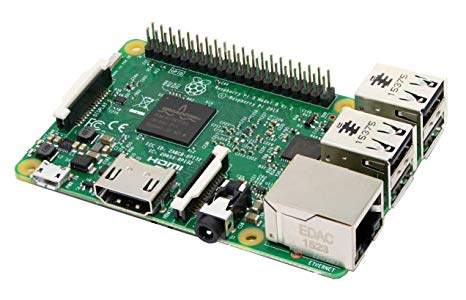
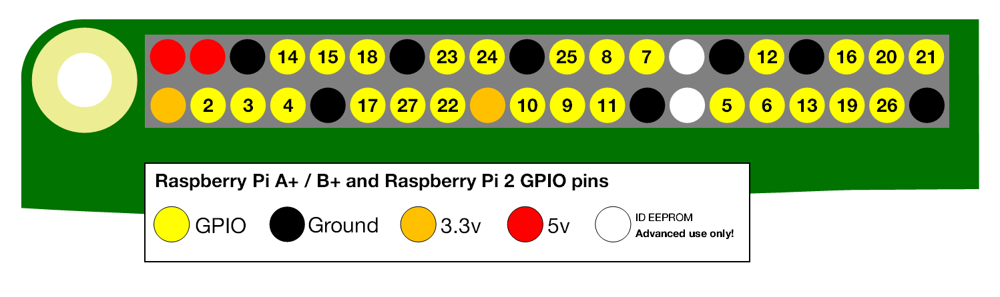

# Le Raspberry PI



Le Raspberry PI est un nano-ordinateur. Il est donc programmable et peut ainsi envoyer des "données" \(envoyer du courant afin d'allumer une [led](https://fr.wikipedia.org/wiki/Diode_électroluminescente) par exemple\) ou réceptionner des "données" \([réceptionner les données d'un capteur thermique ](https://www.carnetdumaker.net/articles/mesurer-une-temperature-avec-un-capteur-lm35-et-une-carte-arduino-genuino/)par exemple\) tout comme un Arduino. Il est cependant plus "puissant" concernant le processeur et la mémoire vive, pouvant supporter un système d'exploitation ou exécuter des algorithme implémenter dans des langages dit haut-niveau comme le langage Python.

| Alimentation | Documentation | Datasheet |
| :--- | :--- | :--- |
| 5 Volt | [https://www.raspberrypi.org/documentation/](https://www.raspberrypi.org/documentation/) | [https://static.raspberrypi.org/files/product-briefs/Raspberry-Pi-Model-Bplus-Product-Brief.pdf](https://static.raspberrypi.org/files/product-briefs/Raspberry-Pi-Model-Bplus-Product-Brief.pdf) |

### Installation du système d'exploitation Raspbian pour le Raspberry PI

Raspbian est une [distribution Linux](https://fr.wikipedia.org/wiki/Distribution_Linux) conçu pour le Raspberry PI. Pour l'installer il suffit de se rendre sur le site officiel du Raspberry PI et d'aller vers l'onglet "download", l'image ISO est disponible en cliquant sur l'onglet "Raspian".

**Note :** L'image ISO doit être transféré vers une carte SD qui à l'issu devra être inséré dans le Raspberry PI, nous avons utilisé **le logiciel Etcher** afin d'effectuer cette manœuvre.

#### Premier démarrage

Si les premiers pas ont été effectués et le Raspberry PI allumé, il suffit de se connecter avec le login _**pi**_ et le mot de passe : _**raspberry**_.

